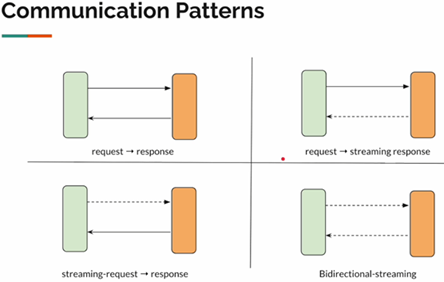
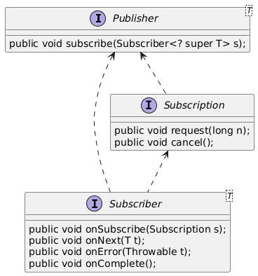

# [Mastering Java Reactive Programming [From Scratch - 2024]](https://www.udemy.com/course/complete-java-reactive-programming/)

Curso tomado de `Udemy` del autor `Vinoth Selvaraj`.

---

## Process, Thread, CPU, RAM

Imaginemos que ha desarrollado una aplicación Java sencilla y la ha empaquetado como un archivo Jar. El archivo Jar se
encuentra ubicado en algún lugar del disco duro. Su programa no es más que un conjunto de instrucciones para ejecutar en
ese momento.

Ahora, cuando digo `java -jar app.jar` se cargará en la memoria creándose un proceso. Así que, un proceso es una
instancia de un programa informático que tiene su propio espacio de memoria aislado, que incluirá código, datos, otros
recursos asignados por el sistema operativo como el socket de memoria, etc.

El proceso es pesado, vive en la memoria ram. Quien ejecuta las instrucciones es el CPU.


### Process

- Una instancia de un programa de computadora
- Incluye código, recursos (alojados por el SO como memoria, sockets, etc.)
- Son ligeros y pesados.

### Thread

- Parte de un proceso
    * Un proceso puede contener uno o más hilos
- Los hilos dentro de un proceso pueden compartir el espacio de memoria.

#### Scheduler

- El scheduler (programador) asignará el hilo a la CPU para su ejecución.
- El scheduler determinará cuánto tiempo puede ejecutarse el hilo.

Si se tiene un proceso y solo cuentas con un procesador (CPU), y cuando tienes múltiples hilos, cambiará entre los
múltiples hilos.


Si se tienen dos procesadores (CPU), intentará asignar un hilo a cada procesador.


Cuando tenemos un único procesador y cuando tienes múltiples programas ejecutándose como Chrome, IntelliJ IDEA, java
app, etc. cuando todos están en marcha y funcionando, cuando tienes múltiples procesos, todos y cada uno de los procesos
tendrán hilos. Así que todos esos hilos (Thread) estarán compitiendo por la CPU.

El scheduler del SO seguirá cambiando entre los hilos (hilos del núcleo o hilos del SO) para la ejecución. A esta acción
lo llamamos cambio de contexto. Así que, cuando se cambia de un hilo a otro, el hilo actual, el punto de ejecución, el
estado tiene que ser almacenado para que pueda ser reanudado más tarde desde el punto en que se detuvo.

Todo lo discutido hasta este punto, no es nada específico de Java. En términos generales todos los procesos funcionan
así.

### Java (Platform) Thread

- Java Thread fue introducido hace 25 años.
- 1 Java Thread = 1 OS Thread
- Recuerda: El OS Thread es la unidad del Scheduling

## Inbound/Outbound (entradas/salidas)

1. Sync
2. Async
3. non-blocking
4. non-blocking + async


1. `Sync`, a primera es muy simple, una comunicación de bloqueo síncrono directo, que todos hemos estado haciendo. La
   aplicación envía una solicitud a otra aplicación. El hilo permanecerá inactivo hasta que reciba la respuesta, no
   puede hacer otra cosa. Se trata pues, de una comunicación síncrona de bloqueo.


2. `Async`, un hilo puede crear otro hilo para delegar la tarea y hacer las cosas de forma asíncrona. Pero, quien quiera
   que esté realizando la tarea desde su perspectiva, estará bloqueado de todos modos. Por ejemplo. Supongamos que
   quiero llamar a una compañía de seguros para hacerle ciertas preguntas, así que le digo a un amigo que lo haga por
   mí, mientras que yo realizo otras cosas. Mi amigo, realiza la llamada, así que es él quién va a tener que esperar a
   que le contesten el teléfono y le respondan las preguntas. En este caso, yo no estoy bloqueado, pero mi amigo sí.


3. `Non-blocking`, supongamos que vuelvo a llamar a la compañía de seguros para hacerle unas preguntas, pero la
   contestadora me indica que nadie está disponible en ese momento para atenderme, pero que deje mi número de teléfono
   para que apenas alguien esté disponible me llame. Mientras eso sucede, yo puedo seguir haciendo mis cosas con
   normalidad.<br><br>
   En este caso, envié una solicitud y no estoy bloqueado, pero después de algún tiempo se me notifica para indicar que
   ya están disponibles.<br><br>
   En una aplicación `no-bloqueante`, la aplicación envía la solicitud a otra aplicación, base de datos, etc. una vez
   enviada la petición, el hilo no se bloqueará, será libre de hacer lo que quiera, cualquier otra tarea. Si está
   disponible, el sistema operativo notificará al hilo diciéndole, oye, tenemos la respuesta.


4. `no-blocking + async`, es una combinación de `non-blocking + async`. Si tienes varias CPUs, ¿por qué un hilo tiene
   que hacer todo el trabajo?, también podemos tener más hilos.<br><br>
   Supongamos que llamo a la compañía de seguros y me dicen, dame tu número, te llamaremos. Ahora, en lugar de dar mi
   número, le doy el de mi amigo para que le devuelvan la llamada. Así que en este caso no estoy bloqueado, mi amigo
   tampoco está bloqueado, pero recibiría la llamada cuando la compañía de seguros esté disponible.<br><br>
   Entonces, aquí un hilo envía una petición a otra aplicación. La respuesta puede tardar un poco, llevará algún tiempo.
   Hasta entonces el hilo no está bloqueado. Cuando la respuesta vuelve, el SO notificará a un hilo diferente que maneje
   la respuesta para hacer uso de múltiples CPUs.

La `programación reactiva` es un modelo de programación para simplificar la comunicación `asíncrona no bloqueante`.

## Patrones de comunicación

Este tipo de patrones de comunicación son posibles lograr fácilmente con la programación reactiva, mientras que el hilo
virtual, la concurrencia estructurada no resuelven estos problemas.



## Reactive Streams Specification

Reactive Streams es una iniciativa que busca proporcionar un estándar para el procesamiento de flujos asíncronos con
contrapresión sin bloqueo. Esto abarca esfuerzos dirigidos a entornos de ejecución(JVM y JavaScript) así como a
protocolos de red.

Palabras claves: `Asíncrono`, `no bloqueante`, `contrapresión`.



La especificación `Reactive Streams` define un conjunto estándar de interfaces para procesar flujos de datos de manera
asíncrona y sin bloqueo, con un control adecuado de la contrapresión `(backpressure)`. Las principales interfaces
incluidas en la especificación son las siguientes:

1. `Publisher<T>`:
    - Es el productor de datos. Emite una secuencia de elementos a los suscriptores interesados.
    - Tiene un único método. Este método permite a los suscriptores registrarse para recibir los elementos que el
      `Publisher` emitirá.
   ````java
   void subscribe(Subscriber<? super T> subscriber);
   ````

2. `Subscriber<T>`:
    - Es el consumidor de datos. Recibe los elementos emitidos por un `Publisher`.
    - Los métodos clave que implementa son:
   ````java
   void onSubscribe(Subscription s);
   void onNext(T t);
   void onError(Throwable t);
   void onComplete();
   ````
    - `onSubscribe(Subscription s)`: Se llama cuando el `Subscriber` se suscribe y recibe un `Subscription` para
      gestionar la comunicación con el `Publisher`.
    - `onNext(T t)`: Se invoca cuando hay un nuevo elemento disponible.
    - `onError(Throwable t)`: Se llama cuando ocurre un error durante el procesamiento del flujo.
    - `onComplete()`: Se invoca cuando el `Publisher` ha emitido todos los elementos.


3. `Subscription`:
    - Representa la relación entre un `Subscriber` y un `Publisher`.
    - Los métodos claves son:
   ````java
   void request(long n);
   void cancel();
   ````
    - `request(long n)`: Controla la cantidad de elementos que el `Subscriber` quiere recibir. Es fundamental para la
      gestión de la contrapresión.
    - `cancel()`: Cancela la suscripción, deteniendo la emisión de más elementos.


4. `Processor<T, R> (opcional)`:
    - Combina las funciones de un `Publisher` y un `Subscriber`. Un `Processor` actúa tanto como un suscriptor de un
      flujo de entrada como un publicador de un flujo de salida.
    - Es un intermediario entre productores y consumidores que permite realizar operaciones intermedias en el flujo de
      datos.

## ¿Qué es la Programación Reactiva?

Un paradigma de programación diseñado para procesar flujos de mensajes de manera asincrónica y sin bloqueos, al tiempo
que se controla la contrapresión.

- Se basa en el patrón de diseño Observer.
- Para llamadas Inbound/Outbound.
- `La programación Reactiva complementa la Programación Orientada a Objetos` al proporcionar herramientas y
  abstracciones potentes para manejar llamadas de E/S asíncronas y administrar flujos de datos complejos en aplicaciones
  modernas.

---

## Creación del proyecto

A continuación se muestran las dependencias que usaremos para trabajar en este proyecto junto con las configuraciones de
`logback.xml`.

## Dependencias

````xml
<!--<maven.compiler.source>21</maven.compiler.source>-->
<!--<maven.compiler.target>21</maven.compiler.target>-->
<!--<project.build.sourceEncoding>UTF-8</project.build.sourceEncoding>-->
<!--<reactor.version>2023.0.8</reactor.version>-->
<!--<logback.version>1.5.8</logback.version>-->
<!--<faker.version>1.0.2</faker.version>-->
<!--<junit.version>5.10.1</junit.version>-->

<dependencies>
    <dependency>
        <groupId>io.projectreactor</groupId>
        <artifactId>reactor-core</artifactId>
    </dependency>
    <dependency>
        <groupId>io.projectreactor.netty</groupId>
        <artifactId>reactor-netty-core</artifactId>
    </dependency>
    <dependency>
        <groupId>io.projectreactor.netty</groupId>
        <artifactId>reactor-netty-http</artifactId>
    </dependency>
    <dependency>
        <groupId>ch.qos.logback</groupId>
        <artifactId>logback-classic</artifactId>
        <version>${logback.version}</version>
    </dependency>
    <dependency>
        <groupId>org.slf4j</groupId>
        <artifactId>slf4j-api</artifactId>
        <version>2.0.16</version>
    </dependency>
    <dependency>
        <groupId>com.github.javafaker</groupId>
        <artifactId>javafaker</artifactId>
        <version>${faker.version}</version>
    </dependency>
    <!-- test dependencies -->
    <dependency>
        <groupId>org.junit.jupiter</groupId>
        <artifactId>junit-jupiter-engine</artifactId>
        <version>${junit.version}</version>
        <scope>test</scope>
    </dependency>
    <!-- step-verifier -->
    <dependency>
        <groupId>io.projectreactor</groupId>
        <artifactId>reactor-test</artifactId>
        <scope>test</scope>
    </dependency>
</dependencies>
````

En el directorio `/src/main/resources` agregaremos el siguiente archivo `logback.xml`.

````xml
<!-- http://dev.cs.ovgu.de/java/logback/manual/layouts.html -->
<configuration>
    <appender name="STDOUT" class="ch.qos.logback.core.ConsoleAppender">
        <encoder>
            <pattern>%d{HH:mm:ss.SSS} %-5level [%15.15t] %cyan(%-30.30logger{30}) : %m%n</pattern>
        </encoder>
    </appender>
    <logger name="io.netty.resolver.dns.DnsServerAddressStreamProviders" level="OFF"/>
    <root level="INFO">
        <appender-ref ref="STDOUT"/>
    </root>
</configuration>
````

**IMPORTANTE**
> Los reactives streams proporcionan un conjunto de interfaces: `Publisher`, `Subscription` y `Subscriber`